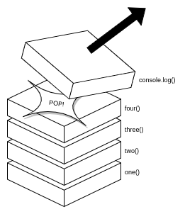

# Reading 10 - In Memory Storage

## In Memory Storage

From the Freecodecamp article [Understanding the JavaScript Call Stack](https://medium.freecodecamp.org/understanding-the-javascript-call-stack-861e41ae61d4)

### Questions

1. What is a ‘call’?
  - When function is invoked and pushed onto the call stack. 
2. How many ‘calls’ can happen at once?
  - Only one at a time.
3. What does LIFO mean?
  - That means Last In First Out in this context its talking about pushing items onto the stack and popping them off -- there is no taking from the middle or the bottom of the stack.
4. Draw an example of a call stack and the functions that would need to be invoked to generate that call stack.



```javascript
const five = () => console.log('we made it');
const four = () => five();
const three = () => four();
const two = () => three();
const one = () => two();

one();
```

5. What causes a Stack Overflow?
  - The call stack size is finite and if that memory is exceeded a stack overflow occurs. Often this happens when a logic error is made and a function is stuck in an infinite loop -- like `while(true)` etc.

## Errors

From codeburst.io [JavaScript error messages](https://codeburst.io/javascript-error-messages-debugging-d23f84f0ae7c)

### Questions

1. What is a ‘reference error’?
  - Happens when a non-existent variable is referenced.
2. What is a ‘syntax error’?
  - Thrown when the runtime tries to interpret invalid code.
3. What is a ‘range error’?
  - When a value is not in the allowed range.
4. What is a ‘type error’?
  - When an operation can not be preformed, typically not the expected type.
5. What is a breakpoint?
  - A point in the code a developer can mark that causes the program to pause at that point. From there we can advance the code call by call.
6. What does the word ‘debugger’ do in your code?
  - It's like adding breakpoint to your code, pausing the program.

## Additional Resources

- JavaScript errors reference on [MDN](https://developer.mozilla.org/en-US/docs/Web/JavaScript/Reference/Errors)

## I want to know more about

- I never use the debugger, I should really start using it. I want to know more about how it works.
- How the heap works.
